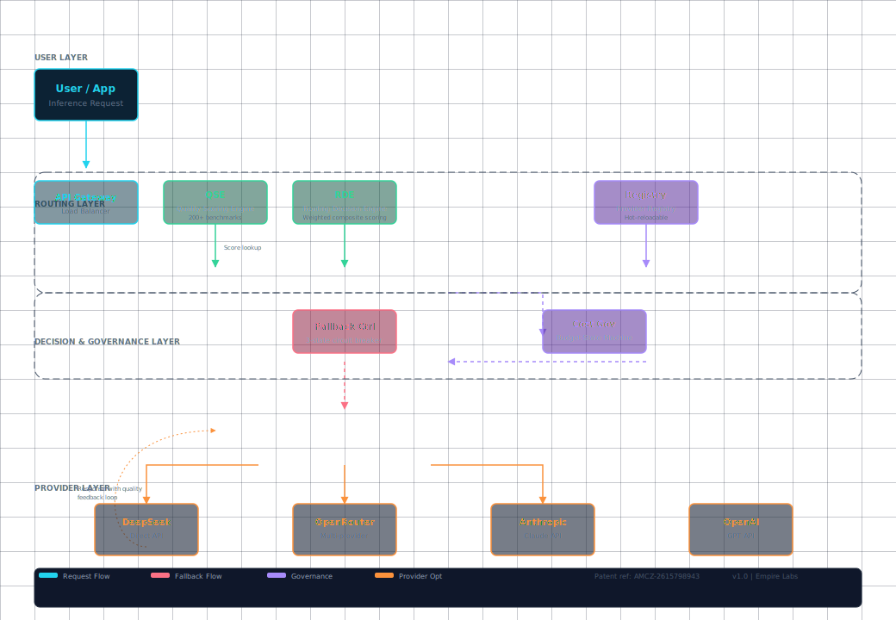

# SmartRouter
**Quality-Aware Intelligent LLM Routing Engine**

[](https://ip-australia.ipaustralia.gov.au/)
[]()
[](https://empirelabs.com.au)

**SmartRouter** is a production-grade LLM routing engine that routes every inference request to the optimal provider based on **quality**, **cost**, and **latency** — not just round-robin or cheapest-first.

Built by **Empire Labs Pty Ltd** (ACN 693 862 145). Patent pending — AU 2026905005 (filed 26 May 2026).

---

## The Problem

LLM providers are not interchangeable. GPT-4o excels at creative tasks but costs 18x more than DeepSeek. DeepSeek is superb at code but weaker at nuanced reasoning. Claude handles long documents but has higher latency.

Most teams pick one provider and stick with it — wasting quality on hard tasks and money on easy ones.

## The Solution

SmartRouter scores every provider against every task category in real-time using a **composite quality engine** with 200+ benchmark categories, then selects the optimal provider using one of two modes:

| Mode | What it optimises | Best for |
|------|-------------------|----------|
| **Weighted** | Balance of quality, cost, latency | Production deployments |
| **Pareto** | Minimum cost above a quality floor | Budget-conscious teams |

## Architecture



### Core Components

| Component | Function |
|-----------|----------|
| **Quality Scoring Engine** | Scores providers across 200+ categories using tunable weights |
| **Circuit Breaker** | Monitors provider health — CLOSED (healthy), OPEN (failing), HALF-OPEN (recovery check) |
| **Cost Governor** | Five-state budget machine — NORMAL → WARN → CRITICAL → HALT → RECOVER |
| **Provider Registry** | Hot-reloadable — add/remove providers without restart |
| **Routing Engine** | Composite scoring + fallback chain + configurable strategy |

### State Machines

**Circuit Breaker:**
```
CLOSED → (failures > threshold) → OPEN → (timeout elapsed) → HALF-OPEN → (success) → CLOSED
                                                                    → (failure) → OPEN
```

**Cost Governor:**
```
NORMAL → (>80% budget) → WARN → (>95%) → CRITICAL → (exceeded) → HALT
HALT → (reset/refill) → NORMAL
RECOVER → (sustained under threshold) → NORMAL
```

---

## Quick Demo

```python
from smartrouter import SmartRouter

router = SmartRouter()

result = router.route(
    prompt="Write a Python binary search tree",
    quality_floor=0.5,
    mode="weighted"
)
print(f"Routed to: {result.provider}")  # deepseek-chat
print(f"Quality: {result.quality_score:.3f}")  # 0.875
print(f"Cost: ${result.cost:.5f}")  # $0.00014
```

Running the demo:
```bash
pip install -r requirements.txt
python examples/quickstart.py
```

---

## API Access

SmartRouter exposes a REST API with API key authentication:

| Endpoint | Method | Description |
|----------|--------|-------------|
| `POST /v1/route` | Route a prompt to the best provider | Takes `prompt`, `quality_floor`, `mode` |
| `GET /v1/stats` | Routing statistics and budget status | Returns request count, cost, active providers |
| `POST /v1/reset` | Reset budget counters | For testing and budget cycles |
| `GET /docs` | Swagger UI | Interactive API documentation |

```
curl -X POST https://api.empirelabs.com.au/v1/route \
  -H "Authorization: Bearer YOUR_API_KEY" \
  -H "Content-Type: application/json" \
  -d '{"prompt": "Explain quantum entanglement simply", "quality_floor": 0.6}'
```

**Request an API key** → [contact@empirelabs.com.au](mailto:contact@empirelabs.com.au)

---

## Patent

SmartRouter's composite scoring methodology is protected by Australian Provisional Patent Application **AU 2026905005**.

---

## Licensing

This repository is a **public showcase** of the SmartRouter architecture and API specification. The core routing engine code is proprietary and available under evaluation license to qualified organisations.

See [LICENSE](LICENSE) for terms.

---

## Coming Soon from Empire Labs

| Product | Description |
|---------|-------------|
| **SmartRouter** | Quality-aware LLM routing *(available now)* |
| **CostGuard** | Multi-currency budget enforcement and cost anomaly detection |
| **AgentGuard** | Action-level AI security — guardrails for autonomous agents |

---

## Contact

**Empire Labs Pty Ltd**  
ACN: 693 862 145  
Email: [contact@empirelabs.com.au](mailto:contact@empirelabs.com.au)  
Patent: AU 2026905005

---


